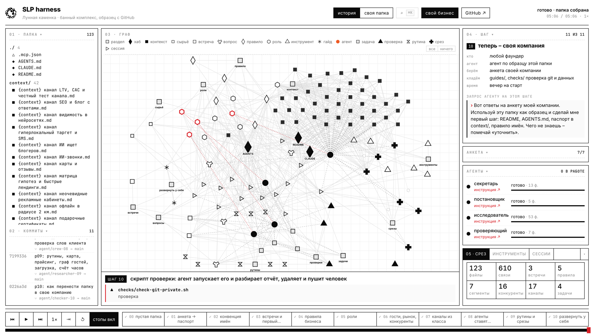

# SLP harness · папка компании

Кит и симулятор к классу SLP'26 «AI for Business», 14 октября 2026. Пример – вымышленный банный комплекс «Лунная каменка» в Москве на 18 человек: будни пустые, отзывы без ответа, договорённости живут в WhatsApp администратора. За десять шагов пустая папка становится системой, которую читают люди и агенты.



**Симулятор:** https://slp-ai-business.lab.aimindset.org/sim/
**Папка компании целиком, с переходами между файлами:** [kit/files/](kit/files/)
**Презентация класса:** https://slp-ai-business.lab.aimindset.org/deck/

## одна линия, десять шагов

Шаг 00 – пустая папка, дальше десять шагов. Каждый шаг опирается на предыдущий. Остановиться можно после любого: уже собранное работает само.

| шаг | что появляется | кто делает | агент |
|---|---|---|---|
| 00 · пустая папка | README, AGENTS.md, git | владелец | не нужен |
| 01 · анкета → паспорт | `context/` паспорт, `sources/` сырьё | владелец отвечает на семь вопросов | секретарь |
| 02 · имена файлов | `rules/` имена файлов | владелец утверждает | переименовывает |
| 03 · встречи и первый вопрос | `meetings/`, `asks/` | администратор включает запись | секретарь |
| 04 · правила | `rules/` цены, голос, данные | управляющий и владелец | ищет расхождения |
| 05 · роли | `people/` | владелец | раскладывает задачи |
| 06 · гости, рынок, конкуренты | `context/` сегменты, рынок, 16 конкурентов; `tools/` | маркетолог | исследователь через Exa |
| 07 · каналы из класса | `context/` 17 каналов | маркетолог | исследователь |
| 08 · агенты ставят задачи | `tasks/`, `checks/` | управляющий подтверждает | секретарь, постановщик, проверяющий |
| 09 · рутины и срезы | `routines/`, `dashboards/` | управляющий читает срезы | рутины по расписанию |
| 10 · развернуть у себя | `guides/`, проверка git и данных | любой фаундер | по образцу этой папки |

Один вопрос «что мы обещали корпоративному клиенту?» растёт вместе с папкой: после встреч агент отвечает по транскрипту, после правил и ролей называет роль и правило, после рутин показывает задачи со статусом и проверяет слова клиента по рынку.

## двенадцать общих типов

Типы одинаковые для любой компании и любой группы. Что именно лежит в файле, говорит имя: `{context} конкурент Сандуновские бани.md`, `{context} сегмент пары.md`. Отдельный тип заводится только для главного, чего много.

| тип | папка | что внутри |
|---|---|---|
| контекст | [context/](kit/files/context/) | паспорт, рынок, конкуренты, сегменты гостей, каналы |
| сырьё | [sources/](kit/files/sources/) | выгрузки броней и отзывов без имён и телефонов |
| встреча | [meetings/](kit/files/meetings/) | транскрипты планёрок и звонков |
| вопрос | [asks/](kit/files/asks/) | вопросы к папке и ответы со ссылками |
| правило | [rules/](kit/files/rules/) | правила бизнеса, каждое на одну страницу |
| роль | [people/](kit/files/people/) | кто что решает; четыре агента – тоже роли, у каждого инструкция и промпт |
| инструмент | [tools/](kit/files/tools/) | Exa, транскрибация, бронирование, отзывы, ИИ-администратор |
| задача | [tasks/](kit/files/tasks/) | исполнитель, срок, ссылка на встречу |
| проверка | [checks/](kit/files/checks/) | задачи по правилам, git и приватные данные |
| рутина | [routines/](kit/files/routines/) | что агенты делают по расписанию |
| срез | [dashboards/](kit/files/dashboards/) | карта, прайсинг, граф гостей, загрузка, счёт часов |
| гайд | [guides/](kit/files/guides/) | как развернуть у себя, закон и данные |

## агенты – это файлы

Четыре агента: секретарь, постановщик, исследователь, проверяющий. Каждый – файл в `people/`, например [агент секретарь](<kit/files/people/{role} агент секретарь.md>): что делает, что читает и пишет, кто принимает работу, чего нельзя, и промпт, который можно вставить в Claude Code или Codex. Правка инструкции – обычная правка файла, видна в git. На графе агент связан со своей инструкцией красным пунктиром, клик по агенту открывает её.

Каждый запуск агента оставляет журнал в [sessions/](kit/files/sessions/): запрос, что прочитал, что создал, ветка и коммит. Агент работает в своей ветке `agent/<роль>-<шаг>`, в main сливает человек:

```
git log --oneline --graph      # ветка агента и слияние на каждом шаге
git show agent/secretary-03    # что именно сделал агент на шаге 03
```

## данные – настоящие

- **16 бань Москвы** с адресами, координатами, ценами, рейтингами и темами отзывов, у каждой цифры источник и дата
- **рынок**: 340 коммерческих бань в Москве и области, средний чек, сезонность, дни недели, тренды, зарплаты: [какой рынок бань в Москве](<kit/files/asks/{ask} какой рынок бань в Москве.md>)
- **17 каналов** из класса SLP про маркетинг с фактами 2026 года и **7 сегментов гостей** с цифрами из опросов – карточки контекста
- **как развернуть у себя**: девять шагов, стек в России с ценами, 152-ФЗ, кейсы: [guides/](kit/files/guides/)

Всё собрано агентом через Exa 8 октября 2026. Цифры меняются – карточки обновляет рутина по понедельникам.

## срезы

| срез | что показывает |
|---|---|
| [карта конкурентов](https://slp-ai-business.lab.aimindset.org/sim/tools/karta.html) | 16 бань на карте, поиск, фильтр по цене часа и рейтингу, радиус от нас |
| [прайсинг](https://slp-ai-business.lab.aimindset.org/sim/tools/praising.html) | наш час зала против соседей, медиана, ползунок «что если» |
| [граф гостей](https://slp-ai-business.lab.aimindset.org/sim/tools/gosti.html) | сегменты × каналы × сообщение: с чего начать пробу |
| [загрузка](https://slp-ai-business.lab.aimindset.org/sim/tools/zagruzka.html) | дни × слоты, где пусто, что даст дневной будний тариф |

Исходники – html-файлы в [dashboards/](kit/files/dashboards/): открываются в браузере прямо из папки.

## проверка перед тем, как делиться

```bash
bash checks/check-git-private.sh
```

Смотрит, всё ли закоммичено, есть ли удалённый репозиторий, нет ли в файлах телефонов, почт, ключей, номеров карт и слов из `.private-words`. Если в папке лежит `.local-only`, удалённого репозитория быть не должно. Агент запускает скрипт и разбирает отчёт, удаляет и пушит человек: [git и приватные данные](<kit/files/checks/{check} git и приватные данные.md>).

## своя компания

**Без терминала:** в симуляторе кнопка «свой бизнес» → тип бизнеса или своя анкета → запросы агенту по двенадцати разделам и стартовая папка архивом. Ответы остаются в браузере.

**С терминалом** (нужны git и Node.js 18+):
```bash
git clone https://github.com/ai-mindset-org/slp-harness.git ~/slp-harness   # движок и образец
~/slp-harness/bin/new.sh ~/harness/lunnaya-kamenka                           # папка компании: коммит на шаг, граф на localhost:4747
cd ~/harness/lunnaya-kamenka && claude                                         # агент сам читает AGENTS.md и CLAUDE.md
```
`new.sh` создаёт папку `~/harness/lunnaya-kamenka` с историей из одиннадцати коммитов (пустая папка и по одному на шаг) и открывает её в режиме «своя папка». Существующую папку не перезаписывает: тогда `bin/open.sh <папка>`. Или двойной клик по `! Open SLP Harness.command`. В открытом движке кнопка «выбрать папку» показывает окно выбора в `~/harness` и переключает граф на другую папку. Папка открывается в Obsidian как хранилище; ссылки между файлами – обычные markdown, работают на GitHub, в Obsidian и у агентов.

## вторая папка: группа

Та же система подходит группе. Свою папку SLP'26 ведущий собрал за вечер из того, что уже было: анкета трека, интро участников, расписание и разборы классов, записи из Notion. Те же двенадцать типов, те же четыре агента: секретарь разбирает запись класса, исследователь подбирает гостей под кластеры, постановщик ставит задачи трека, проверяющий сверяет анонс с правилами потока. классы – встречи, участники, гости и кластеры – карточки контекста, правила потока, роли класса, задачи трека. Папка группы SLP'26 хранится только на компьютере ведущего, помечена `.local-only` и в этот репозиторий не входит. Открывается тем же движком: `HARNESS_KIT=slp bin/open.sh <папка группы>`.

## устройство

```
kit/
  answers.json        ответы анкеты: подставляются в {{company}} и другие поля
  manifest.json       шаги 00–10: запрос агенту, «как это работает», карточка шага, сессии и ветки агентов; 4 агента
  files/              папка компании в финальном виде; README в каждом разделе
  files/_assets/      превью конкурентов
  versions/           промежуточные версии: AGENTS.md, ответ на вопрос
tools/                timeline · build-scenario · build-kit · export-tools · harness-server · harness-demo
web/                  симулятор: index.html · app.js · setup.js · styles.css · sections.json · tools/
bin/                  new.sh · open.sh · fork.sh · replay.sh · stop.sh
```

Правка кита: файл в `kit/files/` или шаг в `kit/manifest.json` → `node tools/build-scenario.mjs`.

Движок – форк маркетинг-харнесса AI Mindset: https://github.com/ai-mindset-org/marketing-harness
