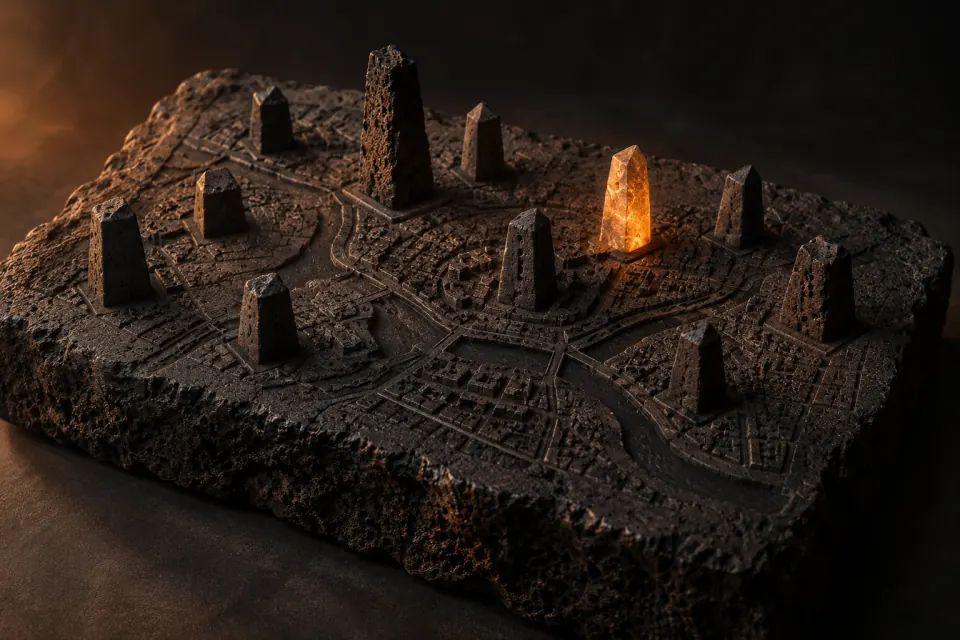

# конкуренты

**уровень 2 · правила и карточки** · реальные бани Москвы: цены, рейтинг, отзывы, каналы, источник с датой.

## файлы
- [Cave](<{competitor} Cave.md>) – Cave – Мягкий пар по авторской технологии «Кейв»: 40-минутный ритуал вместо жёсткого парения, аудитория 25-34 лет – 51% (Forbes
- [GOOSI Баня & Spa](<{competitor} GOOSI Баня & Spa.md>) – GOOSI Баня & Spa – Иммерсивный формат 2-4 часа в парке: свет, звук и ароматы вместо классического парения; аудитория 18-36 лет – 70% (Forbe
- [Siberia](<{competitor} Siberia.md>) – Siberia – Бани как путешествие по регионам России: авторские 4-часовые ритуалы за 32 000+ ₽ с человека, корпоративы и клуб. 13 400
- [Бани Малевича](<{competitor} Бани Малевича.md>) – Бани Малевича – Лесной парк рядом с Москвой: ресторан, большой женский разряд, звукоизолированные кабинеты; пармастеру платят 100-250 ты
- [Варшавские бани](<{competitor} Варшавские бани.md>) – Варшавские бани – Больше всех оценок в Яндексе среди бань выборки (9 055); общий разряд около 3 000-4 000 ₽ вне центра
- [Воронцовские бани](<{competitor} Воронцовские бани.md>) – Воронцовские бани – Средняя цена в центре, 8 тематических номеров, ежечасная смена пара
- [Жар-Птица](<{competitor} Жар-Птица.md>) – Жар-Птица – Масштаб: 50-тонные печи, ресторан и пиво, общая спа-зона для пар и компаний; символ банного ренессанса Москвы
- [Краснопресненские бани](<{competitor} Краснопресненские бани.md>) – Краснопресненские бани – Доступные цены общего отделения в центре, собственное пиво и номера с бассейном
- [Павелецкие бани](<{competitor} Павелецкие бани.md>) – Павелецкие бани – Современный дизайн с классической схемой пара для жителей новых ЖК и бизнес-центров
- [Потаповские бани](<{competitor} Потаповские бани.md>) – Потаповские бани – Баня у дома в Южном Бутове: ежечасные ароматные парения, безлимит и парковка
- [Ржевские бани](<{competitor} Ржевские бани.md>) – Ржевские бани – Самый низкий чек выборки: мужской разряд 1 800-1 890 ₽ на 3,5 часа
- [Сандуновские бани](<{competitor} Сандуновские бани.md>) – Сандуновские бани – Историческая баня 1808 года в центре: общий пар, ресторан, номерные бани; выручка 1,3 млрд ₽ в 2023 (СПАРК через Forbes)
- [Селезнёвские бани](<{competitor} Селезнёвские бани.md>) – Селезнёвские бани – Исторические залы с мансардными окнами, сеансы 2,5-3 часа по умеренной цене
- [ТайгаПар](<{competitor} ТайгаПар.md>) – ТайгаПар – Рекордная изразцовая печь, мужское братство и vip-сьюты в Москва-Сити
- [Таёжные бани](<{competitor} Таёжные бани.md>) – Таёжные бани – Усадьба: у каждой компании свой сруб, двор и отдельный вход; парение для пары 30 000 ₽
- [Усачёвские бани](<{competitor} Усачёвские бани.md>) – Усачёвские бани – Безлимит по времени, свежий пар каждый час, пар-мастера, домашняя кухня

## запросы агенту, от простого к сложному
| сложность | запрос |
|---|---|
| 1 · просто | У кого из соседей рейтинг выше нашего? |
| 2 · средне | Через Exa обнови цены у трёх соседей: источник и дата у каждой цифры. |
| 3 · сложно | Сравни наш прайс со всеми соседями по цене часа и предложи позицию. Решение за управляющим. |

← [вся папка](../README.md)
