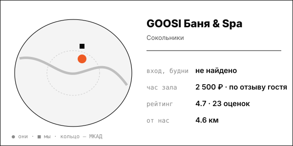

# GOOSI Баня & Spa (НОВЫЙ, иммерсивный формат в парке)

Иммерсивный формат 2-4 часа в парке: свет, звук и ароматы вместо классического парения; аудитория 18-36 лет – 70% (Forbes, 2024).

| | |
|---|---|
| адрес | Москва, Песочная аллея, 7А (парк Сокольники) |
| метро | не указано в найденных источниках |
| часы | пн-чт 10:00-22:00, пт-вс 10:00 до последнего гостя (goo.si) |
| формат | иммерсивная баня и спа для компаний: сеансы по 2-4 часа, аренда под дни рождения, девичники, корпоративы |
| зоны | парная, кедровые купели, джакузи из кедра, ледяная ванна, аква-зона, мини-кинотеатр |
| вместимость | 1-8 гостей в калькуляторе сеансов; до 16 по данным каталога |
| от нас | 4.6 км по прямой |

## цены
| что | цена | откуда и когда |
|---|---|---|
| выходной день, час, всё включено (по отзыву гостя) | 2 500 ₽ за час | goo.si/about/reviews, дата отзыва не указана |
| ориентир каталога sauna-77.ru | от 2 500 ₽/час | 2026-10-08 (снимок) |

**Приватный час:** будни – расчёт по дню и числу гостей только в калькуляторе сайта, значения не извлечены; выходные – 2 500 ₽/час (отзыв гостя)

## рейтинг
| где | оценка | оценок |
|---|---|---|
| 2ГИС | 4.7 | 23 |

## что пишут гости
- **хвалят:** продуманный интерьер, пар-мастера «влюблены в дело»; удобное расположение в Сокольниках; хорошее соотношение цены и качества (отзыв)
- **ругают:** «цены космос» по отзыву в 2ГИС; возможны шумные соседи по пространству

## каналы
сайт, Telegram/VK

## источники
- https://goo.si/
- https://goo.si/seansy/seansy
- https://goo.si/about/reviews
- https://2gis.ru/moscow/firm/70000001040040676/tab/reviews
- https://sauna-77.ru/sauna/goosi-bannyy-kompleks
- https://www.forbes.ru/svoi-biznes/531378-vseobsee-vygoranie-kak-30-letnie-polubili-bani-i-uskorili-rost-etogo-rynka

Карточку собрал агент через [exa](<../tools/{tool} exa.md>) по шагам из [кто конкуренты рядом](<../asks/{ask} кто конкуренты рядом.md>), 8 октября 2026. Все соседи на карте: [карта конкурентов](<../dashboards/{dashboard} карта конкурентов.html>), цены рядом: [прайсинг](<../dashboards/{dashboard} прайсинг.html>).
