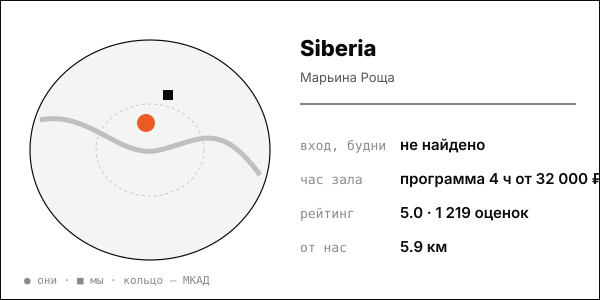

# Siberia (НОВЫЙ, премиум частный формат)

Бани как путешествие по регионам России: авторские 4-часовые ритуалы за 32 000+ ₽ с человека, корпоративы и клуб. 13 400 гостей в 2024 (+15%), выручка +26% (Forbes).

| | |
|---|---|
| адрес | Москва, ул. Образцова, 31, стр. 3 (второй комплекс: ул. Новая Переведеновская, 6, стр. 3) |
| метро | Марьина Роща, Достоевская, Савёловская (dai-zharu.ru) |
| часы | ежедневно 10:00-00:00 (siberia-spa.ru, 2026-10-08) |
| формат | сеть премиальных банных спа-комплексов: 10 бань на дровах, программа парения 4 часа, закрытый банный клуб |
| зоны | 10 бань от 2 до 20 гостей (Кочевник до 4 чел./77 м², Ольхон до 6, Знахарь до 6, Таёжная изба до 15, Искер до 20/204 м², Курная изба и Аркаим на двоих) |
| вместимость | от 2 до 20 гостей на баню |
| от нас | 5.9 км по прямой |

## цены
| что | цена | откуда и когда |
|---|---|---|
| авторская программа парения 4 часа, с гостя | от 32 000 ₽ (Таёжная изба) до 35 000 ₽; на двоих 43 300-55 000 ₽ | siberia-spa.ru/programs, 2026-10-08 |
| корпоративная баня / выездная баня / день рождения | от 350 000 / от 150 000 / от 350 000 ₽ | Yell.ru, 2025-09-08 |
| парение в 4 руки, парение в валенках | 12 000 ₽ каждое | Yell.ru, 2025-09-08 |

**Приватный час:** будни – почасовой аренды нет: программа 4 часа от 32 000 ₽ с гостя (дети 7-10 лет 10 000 ₽ пн-чт); выходные – дети 7-10 лет 15 000 ₽ пт вечер-вс; взрослая цена без разделения в источнике

## рейтинг
| где | оценка | оценок |
|---|---|---|
| Яндекс Карты | 5.0 | 1219 |
| Zoon | 4.9 | 1603 |
| Yell.ru | 5.0 | 541 |

## что пишут гости
- **хвалят:** чистота, уют, просторная зона отдыха (Yell); вежливый персонал помогает с организацией; сибирские традиции, парение пар-мастеров, раки и квас после бани
- **ругают:** высокая цена (по отзыву: «стоит прилично, но за традиции не жалко»)

## каналы
сайт, клуб, Telegram/VK

## источники
- https://siberia-spa.ru/
- https://siberia-spa.ru/programs
- https://www.yell.ru/moscow/com/bannyj-spa-kompleks-siberia-na-ulice-obrazcova_14411984/
- https://zoon.ru/msk/sauna/bannyj_spa-kompleks_siberia_na_ulitse_obraztsova/
- https://www.forbes.ru/svoi-biznes/531378-vseobsee-vygoranie-kak-30-letnie-polubili-bani-i-uskorili-rost-etogo-rynka

Карточку собрал агент через [exa](<../tools/{tool} exa.md>) по шагам из [кто конкуренты рядом](<../asks/{ask} кто конкуренты рядом.md>), 8 октября 2026. Все соседи на карте: [карта конкурентов](<../dashboards/{dashboard} карта конкурентов.html>), цены рядом: [прайсинг](<../dashboards/{dashboard} прайсинг.html>).
