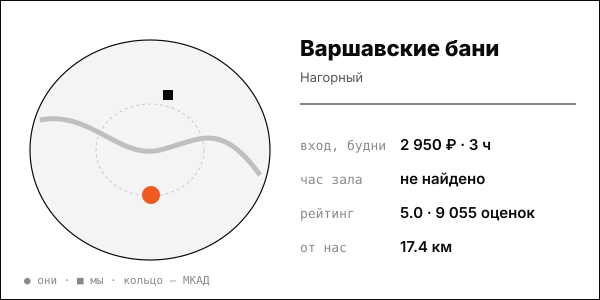

# Варшавские бани

Больше всех оценок в Яндексе среди бань выборки (9 055); общий разряд около 3 000-4 000 ₽ вне центра.

| | |
|---|---|
| адрес | Москва, Варшавское шоссе, 34 |
| метро | Нагатинская (370 м), платформа Нагатинская (97 м) |
| часы | пн-пт 9:00-23:00, сб-вс 8:00-23:00 (varshavskie-bani.ru, 2026-10-08) |
| формат | четырёхэтажный комплекс 1938 года: общие разряды, кабинеты, «бани мира», ресторан |
| зоны | высший разряд (бассейн, джакузи), мужской и женский общие разряды с кабинками, бани мира (до 6 и до 8 человек), спа-услуги, кухня |
| вместимость | бани мира на 6 и 8 человек |
| от нас | 17.4 км по прямой |

## цены
| что | цена | откуда и когда |
|---|---|---|
| общий мужской разряд, билет на 3 часа | 2 950 ₽ | varshavskie-bani.obiz.ru; страница получена 2026-10-08; дата публикации цены на странице не указана |
| женский разряд, билет на 3,5 часа | 2 850 ₽ | varshavskie-bani.obiz.ru; страница получена 2026-10-08; дата публикации цены на странице не указана |
| билет по данным старой выгрузки (3,5 часа, будни / пятница-выходные) | 2 400 ₽ / 2 500 ₽ (с приложением лояльности 2 160 ₽ / 2 250 ₽) | max.akademiakhv.ru, 2023-08-23 (устарело) |
| выходные, 3 часа, далее 25 ₽/мин, доп. час 1 500 ₽ (по отзыву гостя) | 4 000 ₽ | отзыв Яндекс Карт, 6 мая 2026 |

**Приватный час:** будни – не найдено; выходные – не найдено

## рейтинг
| где | оценка | оценок |
|---|---|---|
| Яндекс Карты | 5.0 | 9055 |

## что пишут гости
- **хвалят:** атмосфера 89% положительных, отдых 85%, кухня 85%; баня 81% положительных (2732 отзыва), персонал 75%; удобная логистика: метро и авто
- **ругают:** время ожидания: 38% отрицательных (151 отзыв); бассейн: только 45% положительных; ремонт: 51% положительных

## каналы
сайт, мобильное приложение и лояльность

## источники
- https://varshavskie-bani.ru/
- https://varshavskie-bani.obiz.ru/price/
- https://max.akademiakhv.ru/teaching/varshavskie-bani-v-moskve-ofitsialnyy-sayt-telefon
- https://yandex.ru/maps/org/varshavskiye_bani/1142380611/reviews/

Карточку собрал агент через [exa](<../tools/{tool} exa.md>) по шагам из [кто конкуренты рядом](<../asks/{ask} кто конкуренты рядом.md>), 8 октября 2026. Все соседи на карте: [карта конкурентов](<../dashboards/{dashboard} карта конкурентов.html>), цены рядом: [прайсинг](<../dashboards/{dashboard} прайсинг.html>).
