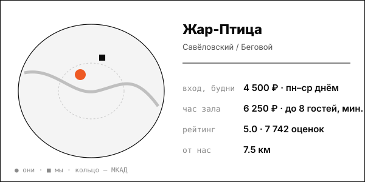

# Жар-Птица (Нижняя Масловка)

Масштаб: 50-тонные печи, ресторан и пиво, общая спа-зона для пар и компаний; символ банного ренессанса Москвы.

| | |
|---|---|
| адрес | Москва, Нижняя Масловка, 15, стр. 3 |
| метро | Савёловская (10 мин пешком), Динамо (12 мин) |
| часы | ежедневно 9:00-23:00, банный комплекс 9:00-22:00 (jarpticabani.ru, 2026-10-08) |
| формат | банный комплекс 4 000 м² (инвестиции ~600 млн ₽, открытие осень 2022, Alba Group) |
| зоны | мужской разряд 166 мест (3 кабинета, 2 парные, 3 купели), женский 50 мест, общий спа-зал до 50 гостей (хаммам, соляной грот, 3 массажных кабинета), 5 банных номеров, ресторан 150 мест, своё пиво |
| вместимость | номера до 8-10 гостей; общий спа-зал до 50; 16-20 тыс. посетителей в месяц (Московские новости, 2024-06-14) |
| от нас | 7.5 км по прямой |

## цены
| что | цена | откуда и когда |
|---|---|---|
| мужской разряд, билет: пн–ср до 15:30 / пн–ср вечером | 4 500 ₽ / 5 300 ₽; чт–пт вечером и сб–вс 6 400 ₽ плюс депозит 6 000 ₽ | jarpticabani.ru, прайс «цены с 01.08»; страница получена 2026-10-08; дата публикации цены на странице не указана |
| женский разряд, билет, сб–вс | 6 400 ₽ | jarpticabani.ru, прайс «цены с 01.08» |
| банный номер «СССР» (до 8 гостей), час | от 6 250 ₽, минимум 4 часа | jarpticabani.ru/maslovka; страница получена 2026-10-08; дата публикации цены на странице не указана |
| номера «Азия» и «Казань» / «Шале» (до 10 гостей), час | от 7 500 ₽ / от 8 750 ₽ | jarpticabani.ru/maslovka; страница получена 2026-10-08; дата публикации цены на странице не указана |
| кабинеты №1–2 в общем разряде, аренда | 22 500–32 500 ₽ за сеанс | jarpticabani.ru, прайс «цены с 01.08» |
| банные номера: СССР до 8 гостей / Азия до 10 / Шале до 10 / Казань до 8 / Плёс до 8 | от 6 250 / 7 500 / 8 750 / 7 500 / 7 500 ₽ в час | jarpticabani.ru, 2026-10-08 |

**Приватный час:** будни – от 6 250 ₽/час (номер «СССР», мин. 4 часа), до 8 750 ₽ (Шале); выходные – не найдено отдельно (на сайте «от»)

## рейтинг
| где | оценка | оценок |
|---|---|---|
| Яндекс Карты | 5.0 | 7742 |
| 2ГИС | 4.5 | 346 |

## что пишут гости
- **хвалят:** не найдено
- **ругают:** не найдено

## каналы
сайт, VK, WhatsApp/Telegram/Max (бронь)

## источники
- https://jarpticabani.ru/menu/price/
- https://jarpticabani.ru/maslovka/
- https://yandex.ru/maps/org/zhar_ptitsa/84731871137/
- https://2gis.ru/moscow/firm/70000001063285833
- https://style.rbc.ru/impressions/6a1e98e39a7947097522e37c
- https://style.rbc.ru/impressions/6a1e98e39a7947097522e37c
- https://www.mn.ru/long/o-bannyj-mir-kto-i-kak-parit-moskvichej

Карточку собрал агент через [exa](<../tools/{tool} exa.md>) по шагам из [кто конкуренты рядом](<../asks/{ask} кто конкуренты рядом.md>), 8 октября 2026. Все соседи на карте: [карта конкурентов](<../dashboards/{dashboard} карта конкурентов.html>), цены рядом: [прайсинг](<../dashboards/{dashboard} прайсинг.html>).
