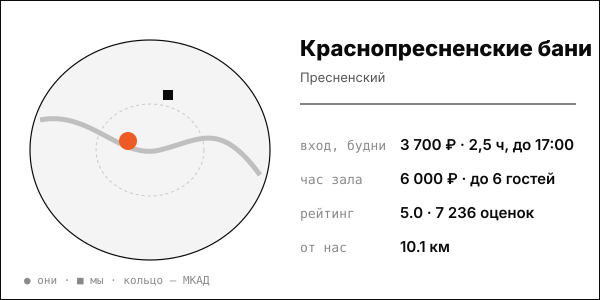

# Краснопресненские бани

Доступные цены общего отделения в центре, собственное пиво и номера с бассейном.

| | |
|---|---|
| адрес | Москва, Столярный пер., 7, стр. 1 |
| метро | не указано в найденных источниках |
| часы | ежедневно 8:00-23:00, понедельник до 22:00 (baninapresne.ru, 2026-10-08) |
| формат | общественные разряды, хаммам, солевая сауна, своя пивоварня, номера-люкс |
| зоны | общее отделение (кабинки по 6 мест), спа-салон, бассейн, пивоварня BRAUKON, бар «Преснявары», номера-люкс |
| вместимость | номера на 6, 8 и 10 человек |
| от нас | 10.1 км по прямой |

## цены
| что | цена | откуда и когда |
|---|---|---|
| общее отделение, сеанс 2,5 часа, будни до 17:00 | 3 700 ₽ (после 17:00 и в выходные 4 500 ₽) | baninapresne.ru/man; страница получена 2026-10-08; дата публикации цены на странице не указана |
| дети 7–14 лет, ежедневно | 1 500 ₽ (до 7 лет бесплатно) | baninapresne.ru/man; страница получена 2026-10-08; дата публикации цены на странице не указана |
| номер с финской сауной и бассейном, час | 6 000–7 000 ₽ | baninapresne.ru; страница получена 2026-10-08; дата публикации цены на странице не указана |
| номер люкс с русской парной и бильярдом на 10 человек, час | 14 000 ₽ | baninapresne.ru; страница получена 2026-10-08; дата публикации цены на странице не указана |
| номера-люкс: финская сауна с бассейном до 6 чел. / то же / русская парная до 10 чел. | 6 000 / 7 000 / 14 000 ₽ в час | baninapresne.ru, 2026-10-08 |

**Приватный час:** будни – 6 000-7 000 ₽/час (до 6 человек), 14 000 ₽/час (до 10 человек); выходные – не найдено отдельно

## рейтинг
| где | оценка | оценок |
|---|---|---|
| Яндекс Карты | 5.0 | 7236 |
| блок на собственном сайте | 5.0 | 1797 |
| Zoon | 3.6 | 100 |

## что пишут гости
- **хвалят:** не найдено
- **ругают:** не найдено

## каналы
сайт, Telegram/VK

## источники
- https://baninapresne.ru/man
- https://baninapresne.ru/
- https://yandex.md/maps/org/krasnopresnenskiye_bani/1063467824/
- https://zoon.ru/msk/sauna/tsentr_krasoty_i_zdorovya_krasnopresnenskie_bani_v_stolyarnom_pereulke/

Карточку собрал агент через [exa](<../tools/{tool} exa.md>) по шагам из [кто конкуренты рядом](<../asks/{ask} кто конкуренты рядом.md>), 8 октября 2026. Все соседи на карте: [карта конкурентов](<../dashboards/{dashboard} карта конкурентов.html>), цены рядом: [прайсинг](<../dashboards/{dashboard} прайсинг.html>).
