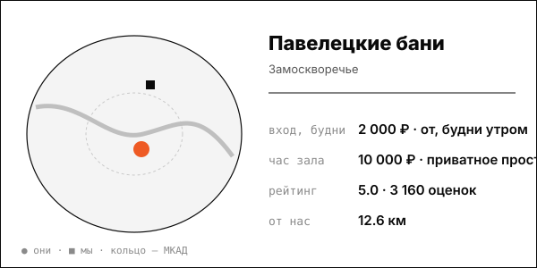

# Павелецкие бани

Современный дизайн с классической схемой пара для жителей новых ЖК и бизнес-центров.

| | |
|---|---|
| адрес | Москва, Жуков проезд, 15 |
| метро | Павелецкая, Серпуховская, Добрынинская (Яндекс Карты) |
| часы | открыто до 23:00 (Яндекс Карты); полное расписание не найдено |
| формат | четырёхэтажный комплекс, открылся в 2022: русская, финская, хаммам, купель, бассейн, vip-залы с караоке, ресторан |
| зоны | общая зона, vip-залы, ресторан |
| вместимость | не найдено |
| от нас | 12.6 км по прямой |

## цены
| что | цена | откуда и когда |
|---|---|---|
| общественный вход, будни утром | от 2 000 ₽ | Forklore, 2026-09-01 |
| приватное пространство, час | от 10 000 ₽ | Forklore, 2026-09-01 |
| общая зона, по списку moscow-city.guide | от 2 500 ₽ | moscow-city.guide, 2026-03-01 |

**Приватный час:** будни – от 10 000 ₽/час (приватное пространство); выходные – не найдено

## рейтинг
| где | оценка | оценок |
|---|---|---|
| Яндекс Карты | 5.0 | 3160 |

## что пишут гости
- **хвалят:** не найдено
- **ругают:** не найдено

## каналы
билеты, сайт/Telegram/VK

## источники
- https://www.forklore.ru/tpost/ea8rn4zlk1-ot-bannogo-lyuksa-do-horoshei-obschestve
- https://moscow-city.guide/articles/luchshie-bani-moskvy-2026-top-15-bannykh-kompleksov/
- https://yandex.ru/maps/org/paveletskiye_bani/205588692715/

Карточку собрал агент через [exa](<../tools/{tool} exa.md>) по шагам из [кто конкуренты рядом](<../asks/{ask} кто конкуренты рядом.md>), 8 октября 2026. Все соседи на карте: [карта конкурентов](<../dashboards/{dashboard} карта конкурентов.html>), цены рядом: [прайсинг](<../dashboards/{dashboard} прайсинг.html>).
