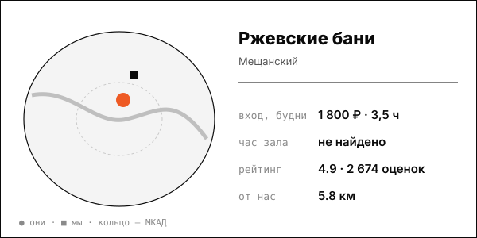

# Ржевские бани

Самый низкий чек выборки: мужской разряд 1 800-1 890 ₽ на 3,5 часа.

| | |
|---|---|
| адрес | Москва, Банный проезд, 3, стр. 1 |
| метро | Рижская (670 м) |
| часы | пн-вс 9:00-23:00; женские дни 9:00-22:00 (rzhevskie-bani.obiz.ru) |
| формат | общий мужской и женский разряды, кабинеты, финская сауна с бассейном, кафе |
| зоны | русская баня на дровах, финская сауна, бассейн, купель, спа, массаж от 1 900 ₽ |
| вместимость | не найдено |
| от нас | 5.8 км по прямой |

## цены
| что | цена | откуда и когда |
|---|---|---|
| мужской разряд, сеанс 3,5 часа, будни / выходные | 1 800 ₽ / 1 890 ₽ | rzhevskie-bani.obiz.ru; страница получена 2026-10-08; дата публикации цены на странице не указана |
| женский разряд, без ограничения по времени, будни / выходные | 1 620 ₽ / 1 710 ₽ | rzhevskie-bani.obiz.ru; страница получена 2026-10-08; дата публикации цены на странице не указана |
| мужской разряд без лимита, по данным birchclub | 2 750 ₽ (2 970 ₽ позже) | birchclub.ru; страница получена 2026-10-08; дата публикации цены на странице не указана |

**Приватный час:** будни – не найдено; выходные – не найдено

## рейтинг
| где | оценка | оценок |
|---|---|---|
| Яндекс Карты | 4.9 | 2674 |
| Zoon (2023-03-03) | 3.5 | 113 |

## что пишут гости
- **хвалят:** не найдено
- **ругают:** не найдено

## каналы
сайт, Telegram/VK

## источники
- https://rzhevskie-bani.obiz.ru/price/
- https://birchclub.ru/rzhevskie
- https://msksauna.ru/banya/rjevskie-bani.html
- https://yandex.ru/maps/org/rzhevskiye_bani/1026946091/

Карточку собрал агент через [exa](<../tools/{tool} exa.md>) по шагам из [кто конкуренты рядом](<../asks/{ask} кто конкуренты рядом.md>), 8 октября 2026. Все соседи на карте: [карта конкурентов](<../dashboards/{dashboard} карта конкурентов.html>), цены рядом: [прайсинг](<../dashboards/{dashboard} прайсинг.html>).
