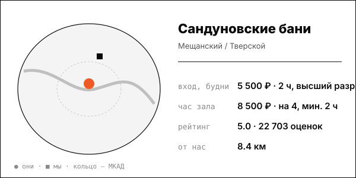

# Сандуновские бани (Сандуны)

Историческая баня 1808 года в центре: общий пар, ресторан, номерные бани; выручка 1,3 млрд ₽ в 2023 (СПАРК через Forbes).

| | |
|---|---|
| адрес | Москва, Неглинная ул., 14, стр. 4 (карточка OSM) |
| метро | Кузнецкий Мост (moscow-city.guide, 2026-03-01) |
| часы | номерные бани открываются в 08:00 (Zoon, 2025-09-14); полное расписание общих разрядов не найдено |
| формат | исторический комплекс 1808 года: общие разряды + номерные бани |
| зоны | 4 мужских разряда (Высший, Второй высший, Первый, Комфорт+), 1 женский, 8 номерных бань, ресторан |
| вместимость | номера на 4, 6 и 10 человек; вместимость общих залов не найдена |
| от нас | 8.4 км по прямой |

## цены
| что | цена | откуда и когда |
|---|---|---|
| высший мужской разряд, билет на 2 часа, будни | 5 500 ₽ | Moscow Pass, 2026-10-03; совпадает с msk.sanduny.ru |
| высший мужской разряд, билет на 2 часа, выходные и праздники | 6 000 ₽ | Moscow Pass, 2026-10-03 |
| второй высший мужской / женское отделение, будни | 3 500 ₽ (выходные 4 000 ₽) | Moscow Pass, 2026-10-03 |
| доплата за 30 минут сверх 2 часов, высший разряд | 1 375 ₽ днём в будни, 1 500 ₽ вечером и в выходные | msk.sanduny.ru, страница получена 2026-10-08; дата публикации цены на странице не указана |
| номерная баня на 4 человека, час | 8 500 ₽ (на 6 человек 12 000 ₽, на 10 человек 16 000 ₽), минимум 2 часа | Moscow Pass, 2026-10-02 |

**Приватный час:** будни – 8 500 ₽/час на 4 человека, минимум 2 часа; 12 000 ₽ на 6; 16 000 ₽ на 10; выходные – не найдено

## рейтинг
| где | оценка | оценок |
|---|---|---|
| Яндекс Карты | 5.0 | 22703 |
| 2ГИС (номерные бани) | 4.8 | 708 |
| Zoon (номерные бани) | 3.7 | 120 |

## что пишут гости
- **хвалят:** не найдено
- **ругают:** Zoon даёт 3,7 против 5,0 в Яндексе: расхождение платформ; тексты отзывов в этом проходе не читались

## каналы
сайт, Telegram/VK

## источники
- https://msk.sanduny.ru/obshchestvennye-razryady
- https://moscowpass.com/ru/blog/sanduny-ili-usachevskie-bani
- https://moscowpass.com/ru/blog/banya-na-kompaniyu-moskva
- https://yandex.com/maps/org/sanduny_bath_house/1346244689/
- https://2gis.ru/moscow/firm/4504127908358441/tab/info
- https://zoon.ru/msk/sauna/nomernye_bani_sandunovskie_bani_na_neglinnoj_ulitse/reviews/
- https://www.forbes.ru/svoi-biznes/531378-vseobsee-vygoranie-kak-30-letnie-polubili-bani-i-uskorili-rost-etogo-rynka

Карточку собрал агент через [exa](<../tools/{tool} exa.md>) по шагам из [кто конкуренты рядом](<../asks/{ask} кто конкуренты рядом.md>), 8 октября 2026. Все соседи на карте: [карта конкурентов](<../dashboards/{dashboard} карта конкурентов.html>), цены рядом: [прайсинг](<../dashboards/{dashboard} прайсинг.html>).
