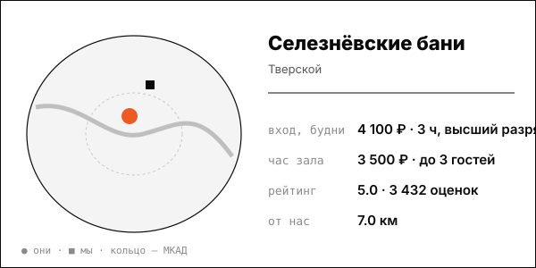

# Селезнёвские бани

Исторические залы с мансардными окнами, сеансы 2,5-3 часа по умеренной цене.

| | |
|---|---|
| адрес | Москва, Селезнёвская ул., 15, стр. 1-2 |
| метро | Достоевская (420 м, Яндекс), Новослободская, Менделеевская |
| часы | касса работает до 20:00; закрытие 22:00 (Zoon); полное расписание не найдено |
| формат | исторические общественные бани 1888 года (архитектор Попов) + 3 номерные бани |
| зоны | высший, первый, второй мужские разряды, женское отделение, парная высшего разряда до 25 человек, номерные бани |
| вместимость | парная высшего разряда до 25 человек |
| от нас | 7.0 км по прямой |

## цены
| что | цена | откуда и когда |
|---|---|---|
| высший разряд, сеанс 3 часа, будни / выходные | 4 100 ₽ / 4 600 ₽ | seleznevskiebani.ru; страница получена 2026-10-08; дата публикации цены на странице не указана |
| женское отделение, сеанс 3 часа, будни / выходные | 2 800 ₽ / 3 100 ₽ | seleznevskiebani.ru; страница получена 2026-10-08; дата публикации цены на странице не указана |
| номер, час (будни, до 3 человек, минимум 2 часа) | от 3 500 ₽; люкс от 4 000 ₽ | seleznevskiebani.ru; страница получена 2026-10-08; дата публикации цены на странице не указана |
| сеанс 2,5 часа по обзору Ведомостей | от 3 300 ₽ будни / от 3 700 ₽ выходные | Ведомости.Город, 2026-08-02 |
| первый мужской разряд, сеанс 2,5 часа, будни / выходные | 3 700 / 4 100 ₽ | seleznevskiebani.ru, 2026-10-08 |
| подготовка парной (2 раза за 1 час) | 1 000 ₽ | seleznevskiebani.ru, 2026-10-08 |

**Приватный час:** будни – от 3 500 ₽/час, до 3 человек, минимум 2 часа; выходные – не найдено

## рейтинг
| где | оценка | оценок |
|---|---|---|
| Яндекс Карты | 5.0 | 3432 |
| Zoon | 3.7 | 23 |

## что пишут гости
- **хвалят:** баня: 86% положительных упоминаний, 1125 отзывов (теги Яндекса); атмосфера 84% положительных; впечатления 88% положительных (1341 отзыв)
- **ругают:** тема «ремонт»: 24% отрицательных, 106 отзывов; интерьер: только 41% положительных; Zoon: высокие цены при посредственном сервисе (отзыв от 2024-12-09)

## каналы
сайт, Telegram/Max (бронь номеров)

## источники
- http://www.seleznevskiebani.ru/
- https://www.vedomosti.ru/gorod/ourcity/articles/vzyat-s-soboi
- https://yandex.ru/maps/org/seleznyovskiye_bani/1037104007/reviews/
- https://zoon.ru/msk/sauna/seleznyovskie_bani_na_seleznyovskoj_ulitse/

Карточку собрал агент через [exa](<../tools/{tool} exa.md>) по шагам из [кто конкуренты рядом](<../asks/{ask} кто конкуренты рядом.md>), 8 октября 2026. Все соседи на карте: [карта конкурентов](<../dashboards/{dashboard} карта конкурентов.html>), цены рядом: [прайсинг](<../dashboards/{dashboard} прайсинг.html>).
