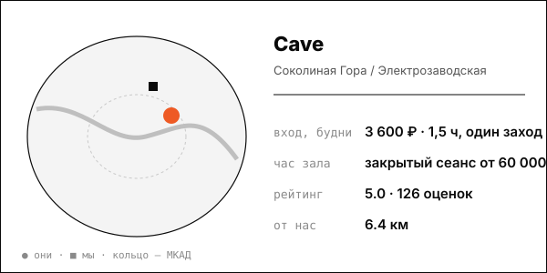

# Cave – пространство мягкого пара (НОВЫЙ, клубный формат)

Мягкий пар по авторской технологии «Кейв»: 40-минутный ритуал вместо жёсткого парения, аудитория 25-34 лет – 51% (Forbes, 02.2025).

| | |
|---|---|
| адрес | Москва, Малая Семёновская ул., 6, к. 1 (цоколь; координата улицы, не дома) |
| метро | Электрозаводская |
| часы | ежедневно 11:00-21:00 (2ГИС) |
| формат | камерное банное пространство в особняке: групповые церемонии мягкого пара, закрытые сеансы |
| зоны | парная мягкого пара, купель, камин, чайная зона, двор |
| вместимость | группы до 10 человек (жалоба гостя: для десяти тесновато) |
| от нас | 6.4 км по прямой |

## цены
| что | цена | откуда и когда |
|---|---|---|
| Must.Cave: 1,5 часа, один заход 40 минут | от 3 600 ₽ | cave.moscow/cave, 2026-10-08 |
| Cave.Отдых: 3-4 часа, два захода | от 10 800 ₽ | cave.moscow/cave, 2026-10-08 |
| закрытый сеанс для компании, 3-4 часа | от 60 000 ₽ | cave.moscow/cave, 2026-10-08 |
| Сиеста (свободный отдых 6 часов) | от 5 400 ₽ | cave.moscow/cave, 2026-10-08 |

**Приватный час:** будни – закрытый сеанс 3-4 часа от 60 000 ₽ (почасовой тариф не публикуется); выходные – не найдено

## рейтинг
| где | оценка | оценок |
|---|---|---|
| Яндекс Карты (число отзывов; рейтинг в сниппете 5,0) | 5.0 | 126 |
| 2ГИС | 4.7 | 17 |

## что пишут гости
- **хвалят:** мягкий влажный пар, атмосфера, камин и тёплые полы; всё включено в билет: текстиль, шампуни, фен; авторская техника веников, группы цигун + баня
- **ругают:** один веник на группу, вопросы к гигиене; раздевалка без дверей и шкафчиков, подвал; ощущение конвейера: сеанс сокращают, цена 9-11 тыс. ₽ не оправдана

## каналы
Telegram (2100), сайт, запись

## источники
- https://cave.moscow/cave
- https://tg.me/cave_moscow
- https://yandex.ru/maps/org/keyv/169961524896/reviews/
- https://2gis.ru/moscow/firm/70000001082771092

Карточку собрал агент через [exa](<../tools/{tool} exa.md>) по шагам из [кто конкуренты рядом](<../asks/{ask} кто конкуренты рядом.md>), 8 октября 2026. Все соседи на карте: [карта конкурентов](<../dashboards/{dashboard} карта конкурентов.html>), цены рядом: [прайсинг](<../dashboards/{dashboard} прайсинг.html>).
