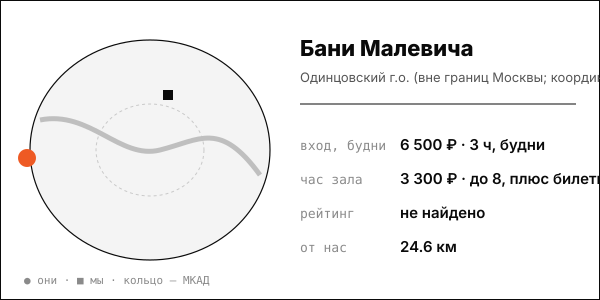

# Бани Малевича (НОВЫЙ, парковый банный клуб, Московская область)

Лесной парк рядом с Москвой: ресторан, большой женский разряд, звукоизолированные кабинеты; пармастеру платят 100-250 тыс. ₽ (hh.ru 2026-08-06).

| | |
|---|---|
| адрес | Московская обл., Одинцовский г.о., парк Малевича, стр. 3 (корпоративный транспорт от м. Крылатское) |
| метро | Крылатское (трансфер) |
| часы | ежедневно 9:00-23:00 (banimalevicha.ru) |
| формат | банный клуб в парке: мужской, женский и общий разряды, приватные кабинеты, панорамный ресторан, банный двор с купелями |
| зоны | мужской разряд, женский разряд (крупнейший), общий (семейный) разряд с детской зоной, кабинеты до 6 и до 10 гостей, хаммам, травяная парная |
| вместимость | кабинеты до 6, до 8 и до 10 гостей |
| от нас | 24.6 км по прямой |

## цены
| что | цена | откуда и когда |
|---|---|---|
| входной билет, 3 часа, будни пн-чт / выходные пт-вс | 6 500 / 7 500 ₽; каждая следующая минута 40 / 60 ₽ | banimalevicha.ru/baths/male, 2026-03-22 |
| аренда кабинета до 6 гостей, будни / выходные | 5 000 / 10 000 ₽, доп. час 10 000 ₽ | banimalevicha.ru, 2026-03-22 |
| аренда кабинета до 8-10 гостей | 10 000 ₽ будни / 20 000 ₽ выходные; крупный кабинет 20 000 / 35 000 ₽ | banimalevicha.ru/suite, 2026-03-22 |

**Приватный час:** будни – кабинет до 8 гостей 10 000 ₽ за 3 часа (около 3 300 ₽/час), доп. час 10 000 ₽, плюс входные билеты 6 500 ₽; выходные – 20 000 ₽ за 3 часа (около 6 700 ₽/час), плюс билеты 7 500 ₽

## рейтинг
| где | оценка | оценок |
|---|---|---|
| Яндекс Карты / 2ГИС / Google | не найдено | – |

## что пишут гости
- **хвалят:** не найдено
- **ругают:** не найдено

## каналы
сайт, Telegram/VK

## источники
- https://banimalevicha.ru/baths/male/
- https://banimalevicha.ru/suite/
- https://banimalevicha.ru/baths/female/
- https://hh.ru/vacancy/135997589

Карточку собрал агент через [exa](<../tools/{tool} exa.md>) по шагам из [кто конкуренты рядом](<../asks/{ask} кто конкуренты рядом.md>), 8 октября 2026. Все соседи на карте: [карта конкурентов](<../dashboards/{dashboard} карта конкурентов.html>), цены рядом: [прайсинг](<../dashboards/{dashboard} прайсинг.html>).
