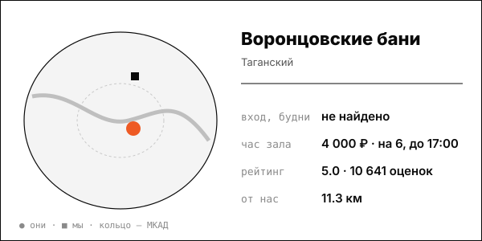

# Воронцовские бани

Средняя цена в центре, 8 тематических номеров, ежечасная смена пара.

| | |
|---|---|
| адрес | Москва, Воронцовский пер., 5/7, стр. 1 |
| метро | Таганская / Пролетарская |
| часы | расписание не найдено (сайт: ежедневно) |
| формат | общественные разряды + 8 номерных бань, ресторан, с 1938 года |
| зоны | 2 мужских разряда, 1 женский, 8 залов номерных бань (Русский зал, Хаммам, Минимализм, Индиана и др.) |
| вместимость | Первый мужской разряд – 140 человек; Высший – 80; номера на 2, 6 и 8-10 человек |
| от нас | 11.3 км по прямой |

## цены
| что | цена | откуда и когда |
|---|---|---|
| номера №1–4 на 2 человека, час, будни до 17:00 / после 17:00 и выходные | 2 500 ₽ / 3 000 ₽, минимум 2 часа | Moscow Pass, начало октября 2026 |
| «Индиана» и «Баня №5» на 6 человек, час | 4 000 ₽ / 5 000 ₽ | Moscow Pass, начало октября 2026 |
| «Русский зал», «Хаммам», «Минимализм» на 8–10 человек, час | 9 000 ₽ / 10 000 ₽, минимум 3 часа | Moscow Pass, начало октября 2026 |
| общественный разряд, 2 часа (поздний сеанс) | от 3 000 ₽ (поздний 2-часовой 1 500 ₽) | Forklore, 2026-09-01 |
| кабинка в общем разряде на 4 часа (билеты отдельно) | 5 000 ₽ | Moscow Pass, 2026-10-02 |
| первый мужской разряд, 4 часа | от 4 000 ₽; кабинки от 5 000 ₽ за 4 часа | vorontsovskie-bani.ru, 2026-10-08 |

**Приватный час:** будни – номера на 2 человека 2 500 ₽/час до 17:00; на 6 человек 4 000 ₽; на 8-10 человек 9 000 ₽ (мин. 3 часа); выходные – 3 000 / 5 000 / 10 000 ₽ соответственно (после 17:00 и в выходные)

## рейтинг
| где | оценка | оценок |
|---|---|---|
| Яндекс Карты | 5.0 | 10641 |
| 2ГИС | 4.6 | 230 |

## что пишут гости
- **хвалят:** не найдено
- **ругают:** не найдено

## каналы
сайт, Telegram (731)

## источники
- https://moscowpass.com/ru/blog/banya-na-kompaniyu-moskva
- https://vorontsovskie-bani.ru/
- https://tg.me/vorontsovskiebani
- https://yandex.ru/maps/org/vorontsovskiye_bani/1079446762/
- https://2gis.ru/moscow/firm/4504128908350831
- https://www.forklore.ru/tpost/ea8rn4zlk1-ot-bannogo-lyuksa-do-horoshei-obschestve
- https://vorontsovskie-bani.ru/

Карточку собрал агент через [exa](<../tools/{tool} exa.md>) по шагам из [кто конкуренты рядом](<../asks/{ask} кто конкуренты рядом.md>), 8 октября 2026. Все соседи на карте: [карта конкурентов](<../dashboards/{dashboard} карта конкурентов.html>), цены рядом: [прайсинг](<../dashboards/{dashboard} прайсинг.html>).
