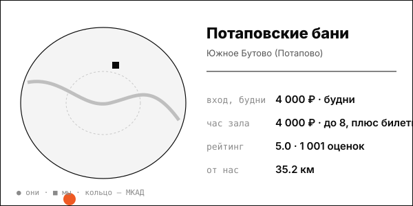

# Потаповские бани (НОВЫЙ, районная премиум-баня)

Баня у дома в Южном Бутове: ежечасные ароматные парения, безлимит и парковка.

| | |
|---|---|
| адрес | Москва, ул. Академика Понтрягина, 14 |
| метро | Бунинская аллея (15 мин пешком) |
| часы | 2ГИС: «откроется в 10:00»; полное расписание не найдено; кухня до 22:00 |
| формат | современная общественная баня, пар каждый час по расписанию из Telegram, безлимит |
| зоны | мужской и женский разряды, общий зал, шторочные кабины (2 по 6 человек), VIP-кабинеты, семейный VIP, 2 купели |
| вместимость | VIP-кабинет до 8 человек (мужской), до 6 (женский, семейный) |
| от нас | 35.2 км по прямой |

## цены
| что | цена | откуда и когда |
|---|---|---|
| вход в мужской разряд, будни | 4 000 ₽ | potapovskiebani.ru/price, 2026-10-08 |
| шторочная кабина (3 часа, от 4 человек) | 4 000 ₽, продление 1 500 ₽/час | potapovskiebani.ru/price, 2026-10-08 |
| VIP-кабинет до 8 человек, 3 часа | 12 000 ₽, продление 4 000 ₽/час | potapovskiebani.ru/price, 2026-10-08 |
| семейный VIP до 6 человек, 3 часа | 8 000 ₽, продление 3 000 ₽/час | potapovskiebani.ru, 2026-10-08 |

**Приватный час:** будни – VIP-кабинет до 8 человек 12 000 ₽ за 3 часа (около 4 000 ₽/час), плюс входные билеты; выходные – не найдено отдельно

## рейтинг
| где | оценка | оценок |
|---|---|---|
| Яндекс Карты | 5.0 | 1001 |
| 2ГИС | 4.9 | 49 |
| Zoon | 4.4 | 56 |

## что пишут гости
- **хвалят:** безлимит по времени и свежий пар каждый час; вкусная кухня и квас, большая бесплатная парковка; дружелюбные банщицы, чисто, система браслетов
- **ругают:** по выходным в женском разряде полная посадка; мало закрытых кабинок, маленькая помывочная, одна небольшая купель; у части гостей качество пара снизилось за пару лет

## каналы
сайт, Telegram (расписание парений)

## источники
- https://potapovskiebani.ru/price
- https://potapovskiebani.ru/
- https://yandex.ru/maps/org/potapovskiye_bani/141772777677/reviews/
- https://2gis.ru/moscow/firm/70000001081043202
- https://zoon.ru/msk/sauna/potapovskie_bani_na_ulitse_akademika_pontryagina/reviews/
- https://hh.ru/vacancy/136502769

Карточку собрал агент через [exa](<../tools/{tool} exa.md>) по шагам из [кто конкуренты рядом](<../asks/{ask} кто конкуренты рядом.md>), 8 октября 2026. Все соседи на карте: [карта конкурентов](<../dashboards/{dashboard} карта конкурентов.html>), цены рядом: [прайсинг](<../dashboards/{dashboard} прайсинг.html>).
