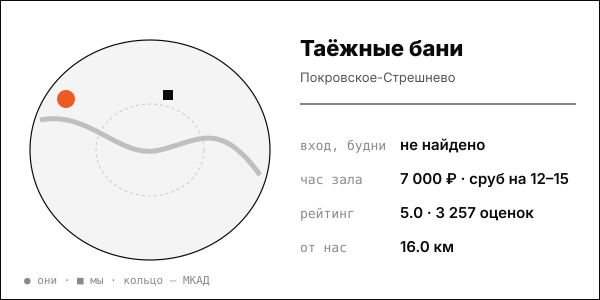

# Таёжные бани

Усадьба: у каждой компании свой сруб, двор и отдельный вход; парение для пары 30 000 ₽.

| | |
|---|---|
| адрес | Москва, Волоколамское ш., 89, к. 1, стр. 1 |
| метро | Тушинская, Волоколамская, Мякинино (Яндекс Медицина) |
| часы | круглосуточно (tbania.ru, Яндекс) |
| формат | 10 приватных бань на дровах со своим двором, ресторан, отель, теннисный корт |
| зоны | 7 срубов (Охотничий, Купеческий, Гжель, Русь, Ермак, Пётр 1, Байкал) и 3 спа-бани (Сибирь, Алтай, Камчатка) |
| вместимость | сруб до 12-15 гостей |
| от нас | 16.0 км по прямой |

## цены
| что | цена | откуда и когда |
|---|---|---|
| сруб на 12–15 гостей, час | 7 000–8 000 ₽ (премиум 13 000–15 000 ₽) | tbania.ru и Moscow Pass, начало октября 2026 |
| скидка в будни с 10:00 до 16:00 | -50% (сруб 3 500–4 000 ₽ в час) | tbania.ru; страница получена 2026-10-08; дата публикации цены на странице не указана |
| парение для пары, программа | 30 000 ₽ | tbania.ru; страница получена 2026-10-08; дата публикации цены на странице не указана |

**Приватный час:** будни – сруб на 12-15 гостей 7 000-8 000 ₽/час; скидка -50% будни 10:00-16:00 (3 500-4 000 ₽); выходные – 7 000-8 000 ₽/час, премиум 13 000-15 000 ₽ (выходные отдельно не выделены)

## рейтинг
| где | оценка | оценок |
|---|---|---|
| Яндекс Карты | 5.0 | 3257 |
| Яндекс (карточка организации) | 5.0 | 1231 |

## что пишут гости
- **хвалят:** не найдено
- **ругают:** не найдено

## каналы
сайт, Telegram

## источники
- https://www.tbania.ru/
- https://moscowpass.com/ru/blog/banya-na-kompaniyu-moskva
- https://yandex.ru/medicine/clinic/tayozhnyye-bani_1110976069

Карточку собрал агент через [exa](<../tools/{tool} exa.md>) по шагам из [кто конкуренты рядом](<../asks/{ask} кто конкуренты рядом.md>), 8 октября 2026. Все соседи на карте: [карта конкурентов](<../dashboards/{dashboard} карта конкурентов.html>), цены рядом: [прайсинг](<../dashboards/{dashboard} прайсинг.html>).
