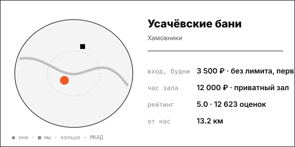

# Усачёвские бани

Безлимит по времени, свежий пар каждый час, пар-мастера, домашняя кухня.

| | |
|---|---|
| адрес | Москва, ул. Усачёва, 10, стр. 1 |
| метро | не указано в найденных источниках |
| часы | второй высший разряд: вт-вс с 09:00, пн с 16:00 (usbani.ru, 2026-10-08); круглосуточно по прежнему обзору |
| формат | общественные разряды без лимита времени + номерной разряд премиум до 10 гостей (с мая 2026) |
| зоны | 3 мужских разряда (Первый, Высший, Второй высший), женское отделение, номерной разряд, ресторан |
| вместимость | номерной разряд до 10 человек |
| от нас | 13.2 км по прямой |

## цены
| что | цена | откуда и когда |
|---|---|---|
| первый мужской разряд, безлимит, будни / выходные | 3 500 ₽ / 4 000 ₽ | страница получена 2026-10-08; дата публикации цены на странице не указана |
| высший мужской разряд, безлимит, будни / выходные | 5 500 ₽ / 6 000 ₽ | страница получена 2026-10-08; дата публикации цены на странице не указана |
| женское отделение, безлимит | 4 000 ₽ в любой день | страница получена 2026-10-08; дата публикации цены на странице не указана |
| кабинка до 6 человек в первом мужском разряде, 3 часа (билеты отдельно) | 5 000 ₽ | Moscow Pass, 2026-10-02 |
| номерной разряд, пример: будни 15:00–18:00 | 40 000 ₽ (1 час по 12 000 ₽ и 2 часа по 14 000 ₽) | Moscow Pass, 2026-10-02 |

**Приватный час:** будни – 12 000 ₽ за 1 час и 14 000 ₽ за 2 часа (пример: будни 15:00-18:00 – 40 000 ₽); выходные – не найдено

## рейтинг
| где | оценка | оценок |
|---|---|---|
| Яндекс Карты | 5.0 | 12623 |

## что пишут гости
- **хвалят:** не найдено
- **ругают:** не найдено

## каналы
сайт, Telegram (2688)

## источники
- https://usbani.ru/price
- https://usbani.ru/
- https://t.me/usachevskiebani
- https://telegramstats.net/stats/usachevskiebani
- https://yandex.ru/maps/org/usachyovskiye_bani/156965845410/
- https://www.raiffeisen-media.ru/zhizn/luchshie-bani-v-moskve-i-podmoskove/

Карточку собрал агент через [exa](<../tools/{tool} exa.md>) по шагам из [кто конкуренты рядом](<../asks/{ask} кто конкуренты рядом.md>), 8 октября 2026. Все соседи на карте: [карта конкурентов](<../dashboards/{dashboard} карта конкурентов.html>), цены рядом: [прайсинг](<../dashboards/{dashboard} прайсинг.html>).
